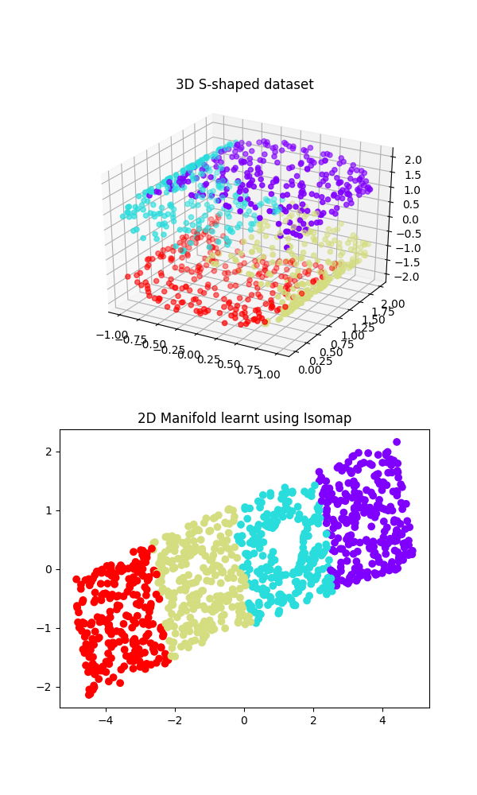
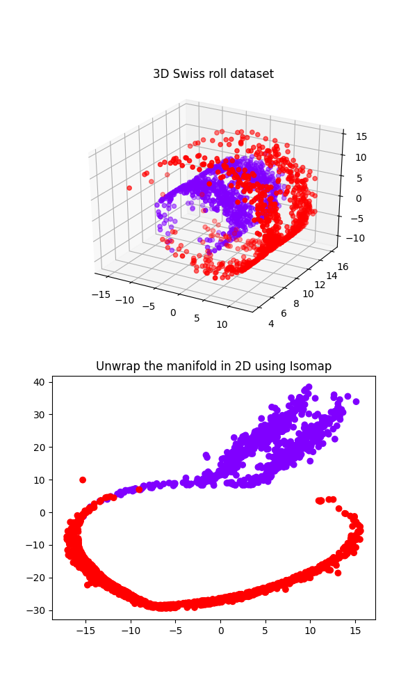

Isomap is a data visualisation technique based on geodesic distance.

Course: [Optimization Methods], Spring 2020 
Taught by: Prof. Jawahar C. V.
 
 

 
 

[Optimization Methods]: https://github.com/iiithf/optimization-methods
